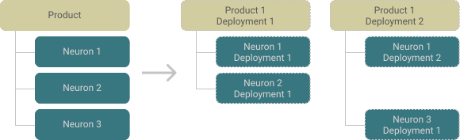

# alis.exchange core concepts 🚀

> 👉 This is a continuation of getting you to talk our talk.
> In this section, we aim to provide you with an overview of the key concepts specific to **alis.exchange**
> for you to get building.

**alis.exchange** has a collection of resources that follow the best practices of resource-oriented design. These resources
are used to elegantly integrate the former technologies in by providing structure and logic around these resources. The
three most important resources to understand at this stage are depicted in the image below.

The three major resources can be communicated as together as an `organisation` having one or more `product`,
consisting of one or more `neuron`. Additionally, `products` have `deployments`, which consists of all, or a subset, of the
`neurons`.

These concepts are unpacked in the following sections. Don't get too frustrated if it does not make sense upon
first reading, everything will be made practical in the next phase of the onboarding.

## Organisation

An `organisation` resource represents the top-level resource on **alis.exchange**.

- _Conceptually_, all `products` built on the exchange belong to a specific `organisation`.
- _Practically_, an `organisation`:
	- Is responsible for billing.
	- Owns and manages users in the organisation along with access management.
	- Has a monorepo in which all resource and service definitions well as infrastructure specification contained.

Examples of `organisations` on **alis.exchange** include <a href="https://alis.capital" target="_blank">alis</a>,
<a href="https://work4aliving.org/" target="_blank">WORK 4 A LIVING</a> and UNUM (link coming soon).

> 💁‍♂ Want to know about your own organisation? Run `alis org list` from your terminal to and look for your organisation
> to see its primary attributes on alis.exchange. Take special note of the `OrganisationID` as you will be using it
> shortly.

## Product

A `product` resource represents a digital product built on **alis.exchange**. The majority of these adopt an API-first strategy.

- _Conceptually_, a `product` is the thing which is offered to the world, whether for usage within an `organisation` or
  as a B2B/B2C product.
- _Practically_, the `product`:
    - Has its own Google Cloud project.
    - Has a repo in which the source code for the `product` is contained.
    - Consists of a group of developers.
    - Can have one or more deployments of the `product`.
    - Manages access to the deployments of the `product`. This may be on an individual or group level.
    - Will specify the various APIs and infrastructure required by the children `neurons` through using
        <a href="https://github.com/alis-x/initial-user-onboarding/blob/master/TechOverview.md#terraform" target="_blank">Terraform</a>.

Example `products` on alis.exchange built by <a href="https://alis.capital" target="_blank">alis</a> include:
- `DE`: _Data Engineering_, responsible for synchronising data from external sources.
- `CP`: _Compliance_, a fast and flexible framework for accurate portfolio compliance at scale.

> 💁‍♂ Want to know about your own organisation's existing products? Run `alis product list {OrganisationID}` from your
> terminal, replacing the ID with your organisations ID (eg. unum, w4al, foo, etc.), to see the list of products
> your organisation is currently building on alis.exchange.

Furthermore, **alis.exchange** itself is a product, `EX`, which delivers its value through leveraging other products
such as `OS`, the _operating system_ facilitating all the resource **alis.exchange** resource management; and `CL`, the
_command-line interface_ which provides a means to interact with `OS` from your terminal.

> 🤔 As you might have picked up, we have adopted the mandatory practice of assigning a two-letter acronym for all
> products. This serves as an identifier for the product and therefore needs to be unique within an organisation.

## Neuron

A `neuron` resource represents the _unit of compute_ used by the parent `product` resource. Each `neuron` is either a
_resource_ type or a _service_ type. The collection of `neurons` in a `product` - ie. the resources,
<a href="https://cloud.google.com/apis/design/standard_methods#:~:text=This%20chapter%20defines%20the%20concept%20of%20standard%20methods%2C%20which%20are%20List%2C%20Get%2C%20Create%2C%20Update%2C%20and%20Delete" target="_blank">
methods on the resources</a> and the services (typically following <a href="https://cloud.google.com/apis/design/custom_methods" target="_blank">
custom methods</a>) - provide all the functionality that a `product` requires to provide its offering.

The `neuron` concept will make a lot more sense when you start using it, we promise!

> 💁‍♂ Want to know about a product's neurons? Run `alis neuron list {OrganisationID}.{ProductID}`
> from your terminal, providing an ID for a desired product identified when running `alis product list {OrganisationID}`

[//]: # (A `neuron` practically equivalent to microservices???)

## Deployments

A _deployment_ refers to an operational instance of a `product` on the cloud which clients would interact with. Under the hood this consists of both
`product deployments` and `neuron deployments`.

### Product deployment

A `product deployment` refers to the hardware infrastructure aspect of the product. As explained in the
[product section](https://github.com/alis-x/initial-user-onboarding/blob/master/ExchangeConcepts.md#product), the
organisation's `proto` repository contains a directory for each product, in which the infrastructure requirements used
within the neurons are specified.

[//]: # (TODO: explain that infrastructure requirements are simply enabling the things and then the exact spec happens)

Before _deploying_ a `product`, it first needs to be _built_ (see `alis product build -h`), which increments the
semantic versioning and applies the **product level** (ie. not those within the `neurons`) Terraform specification
within the `product` Google Cloud project.

When a `product` is _deployed_ (see `alis product deploy -h`), the **product level** (ie. not those within the `neurons`)
Terraform files are used to apply the infrastructure specification, the end `product` being the deployment environment
reflecting the specification in the `*.tf` files. Once deployed, each `product deployment` has its own _Google Cloud
project_.

### Neuron deployment

A `neuron deployment` refers to a specific version of a `neuron` that is operational within a specific `product deployment`,
thereby being a _child resource_ of a `product deployment`.

Before _deploying_ a `neuron`, it first needs to be _built_ (see `alis neuron build -h`). During the build process,
the semantic versioning is incremented and deployment package is created from the source code and the Terraform specification:
1. The hash of the latest commit is captured such as to have a snapshot of the Terraform specification at the
    point in time the `build` was called.
2. The Dockerfile(s) in the `neuron` repo is executed on _[Cloud Build](https://cloud.google.com/build)_ to build the
images from the `neuron` source code, which is stored in the _[Artifact Registry](https://cloud.google.com/artifact-registry)_.

When the `neuron` is _deployed_ to a specific `product deployment` (see `alis neuron deploy -h`), the `neuron` level
Terraform specification is applied in the _Google Cloud project_ of the respective `product deployment`. This
specification will typically contain services which point to the image in the artifact registry that was built when
running `alis neuron build ...`.

A `product deployment` may consist of all the `neurons` within a `product` or a subset thereof. Three common patterns
have emerged from builders on **alis.exchange** which are discussed in the following section.

### Common deployment patterns

To demonstrate the three most typical deployment patterns, consider the example, depicted in the image, of a `product`
consisting of three `neurons`.

### Pattern 1: Full product deployment

The first pattern is where a `product` is deployed having all the `neurons`. This is typically used where a `product` provided
to clients is required to have all the functionality across all the `neurons` and be independent of other `neuron
deployments`.

### Pattern 2: Limited features product deployment

The second pattern is where a `product` is deployed having a subset of `neurons`. This is typically used where a `product`
may have a range of features that may individually be purchased by clients and therefore want to limit those available
in a given `product deployment`.

The image depicts an example where two clients have access to two different `product deployments`. The `product` having the
core functionality as part of `Neuron 1` and additional features being available with the other `neurons`. In the first case,
the client would have the functionality provided by the core `Neuron 1` and the extended functionality of `Neuron 2`.
In the second case, the client would have the functionality provided by the core `Neuron 1` and the extended
functionality of `Neuron 3`.

### Pattern 3: Interdependent neurons product deployment

The final pattern is where multiple `product deployments` may have the need to access a single `neuron` version. This
may be due to various use cases including:
- The shared `neuron` containing a common data set that all `product deployements` are dependent on. 
    _Example_: A common set of core financial instrument resources.
- Architecturally, deciding to use a single Google Cloud product instance to perform the logic of the neuron. 
    _Example_: A <a href="https://cloud.google.com/bigtable/docs/overview" targer="_blank">Cloud BigTable</a> instance
    that is shared by other services to store information.  
	The reasoning being that each BigTable instance is billed.
    Therefore, using a single, shared instance with tight access control provides the same functionality but at a much
    lower cost.

The image depicts an example where `neuron deployments` of multiple `product deployments` make use of an individual,
shared `neuron deployment`.

## Additional resources

A full set of resources can be found in the documentation (link coming soon).

> 💁‍♂ Want to know about how a product's deployments are structured? Run `alis product tree {OrganisationID}.{ProductID}`
> from your terminal, providing an ID for a desired product to see a tree view of product deployments and their
> neuron deployments.

## End 🏁

We know that this may be a lot to take in. We are advocates of learning by doing so in the following onboarding
section, we will guide you through building your first product to bring together the various concepts and technologies
discussed in this section.

> 👟 **Up next:** _[Build your first product](/HelloWorldBuild)_ 👷‍
