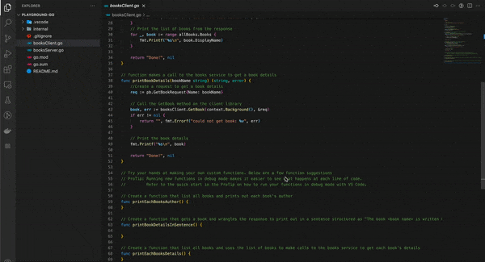

# Make a request to a product

> This section is supplementary to the [quickstart](/getting-started/quick-start.md). We recommend that you first complete the quickstart before 

Given the underlying technologies used, **alis.exchange** provides the ability to generate client libraries for various
supported coding languages. For users of the product, it allows you to programmatically access products natively in your
code without having to wrangle obscure, unpredictable data objects (see [quickstart](/getting-started/quick-start.md)).

Irrespective of the language, this is done in two steps:

1. Establishing a client connection with the server.
2. Using the connection to make a request.

Following the same Book example as the quickstart, this guide will step you through making requests in your own developer environment.

> We currently only provide the guide for Go. Want to help us expand this to other languages? [Make a contribution](https://github.com/alis-x/docs/edit/main/docs/guides/make-your-first-request.md).


## Book repository example

Foo is an organisation that builds products on **alis.exchange**. Their flagship book repository product,`BR`, provides
details on digital books which they have available. The product defines a `book` resource as follows and has a
`BookService` with two primary client facing methods that allows clients to list all available books and to get details
on a specific book.

The full `Books.proto` file is shown for reference purposes.

```protobuf
syntax = "proto3";

package foo.br.resources.books.v1;

import "google/protobuf/empty.proto";
import "google/api/resource.proto";
import "google/api/field_behavior.proto";
import "google/api/client.proto";
import "google/api/annotations.proto";
import "google/protobuf/timestamp.proto";
import "google/protobuf/field_mask.proto";
import "google/type/date.proto";

option go_package = "go.protobuf.foo.alis.exchange/foo/br/resources/books/v1";
// Book service for foo.br.
service BooksService {
	// List all available books.
	rpc ListBooks(ListBooksRequest) returns (ListBooksResponse) {
		option (google.api.http) = {
			get: "/resources/books/v1/books"
		};
	}
	// Get a specific book.
	rpc GetBook(GetBookRequest) returns (Book) {
		option (google.api.http) = {
			get: "/resources/store/v1/{name=books/*}"
		};
		option (google.api.method_signature) = "name";
	}
}

// The definition of a book resource.
message Book {

	// The name of the book.
	// Format: books/{book}.
	string name = 1 [(google.api.field_behavior) = OUTPUT_ONLY];

	// The display name of the book.
	string display_name = 2 [(google.api.field_behavior) = REQUIRED];

	// The authors of the book.
	repeated string authors = 3 [(google.api.field_behavior) = REQUIRED];

	// The publisher of the book
	string publisher = 4 [(google.api.field_behavior) = REQUIRED];
}

// Request message for [foo.br.resources.books.v1.BooksService.CreateBook].
message CreateBookRequest {
	// The book to create
	Book book = 1 [(google.api.field_behavior) = REQUIRED];
}

// Request message for [foo.br.resources.books.v1.BooksService.GetBook].
message GetBookRequest {
	// The book name is the unique identifier across organisations.
	// Format: books/{book}
	string name = 1 [(google.api.field_behavior) = REQUIRED];
}

// Request message for [foo.br.resources.books.v1.BooksService.ListBooks].
message ListBooksRequest {
	// The maximum number of books to return. The service may return fewer than
	// this value.
	// If unspecified, at most 100 books will be returned.
	// The maximum value is 1000; values above 1000 will be coerced to 1000.
	int32 page_size = 1 [(google.api.field_behavior) = OPTIONAL];
}

// Request message for [foo.br.resources.books.v1.BooksService.DeleteBook].
message DeleteBookRequest {
	// The resource name of the Book.
	// Format: books/{book}.
	string name = 1 [(google.api.field_behavior) = REQUIRED];
}

message ListBooksResponse {
	// The books
	repeated Book books = 1 [(google.api.field_behavior) = REQUIRED];
}
```

We will be making requests to both the `ListBooks` and `GetBook` method by following the two steps provided in the introduction section.

### 1. Establish the client connection

Prior to making the requests, a client connection needs to be established to the server.

The `NewConn` function is generated by the alis.exchange CLI when a new neuron is created. This is typically placed in a separate `Conn.go` file but is included as function in this example.

The `NewConn` function requires the specification of a host URL which can be obtained by:
1. Navigating to the specific Cloud Run instance in the GCP Console.
2. Obtaining the URL from the product owner.

```go
package main

import (
	"context"
	"crypto/tls"
	"crypto/x509"
	"log"
	"strings"

	"google.golang.org/api/idtoken"
	"google.golang.org/api/option"
	"google.golang.org/grpc"
	"google.golang.org/grpc/codes"
	"google.golang.org/grpc/credentials"
	"google.golang.org/grpc/credentials/oauth"
	"google.golang.org/grpc/status"

	pb "go.protobuf.foo.alis.exchange/foo/br/resources/books/v1"
)

// The booksClient is defined as a global variable. It is declared once on init and used to call the various methods of the BooksService
var (
	booksClient pb.BooksServiceClient
)

func init() {

	// Pre-declare err to avoid shadowing.
	var err error

	// Declare the server host url and port.
	// This follows the format {{neuronID}}-{{majorVersion}}-{{hash}}-{{region}}.a.run.app:{{port}}
	// Typical predefined values are:
	//  - region: "ew"
	//	- port: "443"
	serverHost := "resources-books-v1-z5x5ywf7za-ew-443.a.run.app"

	// Initialise connection to the books service.
	conn, err := NewConn(context.Background(), serverHost, false)
	if err != nil {
		log.Fatal(err)
	}

	// Initialise the booksClient.
	booksClient = pb.NewBooksServiceClient(conn)
}

func main() {}

type grpcTokenSource struct {
	oauth.TokenSource
}

// Code generated by alis.exchange CLI. DO NOT EDIT.
//
// NewConn creates a new gRPC connection.
// host should be of the form domain:port, e.g., example.com:443
func NewConn(ctx context.Context, host string, insecure bool) (*grpc.ClientConn, error) {
	var opts []grpc.DialOption
	if host != "" {
		opts = append(opts, grpc.WithAuthority(host))
	}

	if insecure {
		opts = append(opts, grpc.WithInsecure())
	} else {
		systemRoots, err := x509.SystemCertPool()
		if err != nil {
			return nil, err
		}
		cred := credentials.NewTLS(&tls.Config{
			RootCAs: systemRoots,
		})
		opts = append(opts, grpc.WithTransportCredentials(cred))
	}

	return grpc.Dial(host, opts...)
}
```

### Make a request

The `booksClient` provides you all the methods available, with descriptions of the methods and a specification of what
the request and responses are. Most IDEs allow you to explore these by hovering over client and method names, similar to
the example shown below.

Let us make our requests.

#### List books

Firstly we will get a list of all the books calling the `ListBooks` methods and then print their display names in the console.

Add the `printBookNames` function to the bottom of your Go file and make a call to the function from `main`.

```go
package main

import "fmt"

var(...)

func main() {
	// Call the printBookNames function
	result, err := printBookNames()
	fmt.Println(result, err)
}

// function makes a call to the books service to get a list of books
func printBookNames() (string, error) {
	// Call the ListBooks method on the client library
	allBooks, err := booksClient.ListBooks(context.Background(), &pb.ListBooksRequest{})
	if err != nil {
		return "", fmt.Errorf("could not list books: %v", err)
	}
	// Print the list of books from the response
	for _, book := range allBooks.Books {
		fmt.Printf("%s\n", book.DisplayName)
	}

	return "Done!", nil
}
```

#### Get book

Secondly, we will get a specific book and print all of its information in the console.

Add the `printBookDetails` function to the bottom of your Go file and make a call to the function from `main` with the provided book name.

```go
package main

import "fmt"

func main() {
	// Call the printBookDetails function
	result, err = printBookDetails("books/c4a2")
	fmt.Println(result, err)
}

// function makes a call to the books service to get a book details
func printBookDetails(bookName string) (string, error) {
	//Create a request to get a book details
	req := pb.GetBookRequest{Name: bookName}

	// Call the GetBook method on the client library
	book, err := booksClient.GetBook(context.Background(), &req)
	if err != nil {
		return "", fmt.Errorf("could not get book: %v", err)
	}

	// Print the book details
	fmt.Printf("%s\n", book)

	return "Done!", nil
}
```

### Full code example

The complete code for both examples are available below.


::: details Click here to view full code example.

```go
package main

import (
	"context"
	"crypto/tls"
	"crypto/x509"
	"log"
	"strings"

	"google.golang.org/api/idtoken"
	"google.golang.org/api/option"
	"google.golang.org/grpc"
	"google.golang.org/grpc/codes"
	"google.golang.org/grpc/credentials"
	"google.golang.org/grpc/credentials/oauth"
	"google.golang.org/grpc/status"

	pb "go.protobuf.foo.alis.exchange/foo/br/resources/books/v1"
)

// The booksClient is defined as a global variable. It is declared once on init and used to call the various methods of the BooksService
var (
	booksClient pb.BooksServiceClient
)

func init() {

	// Pre-declare err to avoid shadowing.
	var err error

	// Declare the server host url and port.
	// This follows the format {{neuronID}}-{{majorVersion}}-{{hash}}-{{region}}.a.run.app:{{port}}
	// Typical predefined values are:
	//  - region: "ew"
	//	- port: "443"
	serverHost := "resources-books-v1-z5x5ywf7za-ew-443.a.run.app"

	// Initialise connection to the books service.
	conn, err := NewConn(context.Background(), serverHost, false)
	if err != nil {
		log.Fatal(err)
	}

	// Initialise the booksClient.
	booksClient = pb.NewBooksServiceClient(conn)
}

func main() {
	// Call the printBookNames function
	result, err := printBookNames()
	fmt.Println(result, err)

	// Call the printBookDetails function
	result, err = printBookDetails("books/c4a2")
	fmt.Println(result, err)
}

// function makes a call to the books service to get a list of books
func printBookNames() (string, error) {
	// Call the ListBooks method on the client library
	allBooks, err := booksClient.ListBooks(context.Background(), &pb.ListBooksRequest{})
	if err != nil {
		return "", fmt.Errorf("could not list books: %v", err)
	}
	// Print the list of books from the response
	for _, book := range allBooks.Books {
		fmt.Printf("%s\n", book.DisplayName)
	}

	return "Done!", nil
}

// function makes a call to the books service to get a book details
func printBookDetails(bookName string) (string, error) {
	//Create a request to get a book details
	req := pb.GetBookRequest{Name: bookName}

	// Call the GetBook method on the client library
	book, err := booksClient.GetBook(context.Background(), &req)
	if err != nil {
		return "", fmt.Errorf("could not get book: %v", err)
	}

	// Print the book details
	fmt.Printf("%s\n", book)

	return "Done!", nil
}

type grpcTokenSource struct {
	oauth.TokenSource
}

// Code generated by alis.exchange CLI. DO NOT EDIT.
//
// NewConn creates a new gRPC connection.
// host should be of the form domain:port, e.g., example.com:443
func NewConn(ctx context.Context, host string, insecure bool) (*grpc.ClientConn, error) {
	var opts []grpc.DialOption
	if host != "" {
		opts = append(opts, grpc.WithAuthority(host))
	}

	if insecure {
		opts = append(opts, grpc.WithInsecure())
	} else {
		systemRoots, err := x509.SystemCertPool()
		if err != nil {
			return nil, err
		}
		cred := credentials.NewTLS(&tls.Config{
			RootCAs: systemRoots,
		})
		opts = append(opts, grpc.WithTransportCredentials(cred))
	}

	return grpc.Dial(host, opts...)
}
```
:::

## Get a feel for the **alis.exchange** experience

Try your hands creating your own function and incorporating a request to the `BooksClient`. Some suggestions of things to try:

* Loop through all the books and print out the author.
* Get a book and wrangle the response to be printed out in a sentence structure.
* Use the response of `ListBooks` to make multiple `GetBook` requests.

::: tip ProTip

Running a new function in debug mode allows you to see what happens at every line of code when a function is executed. To run a function in debug mode in VS Code place a break point next to the line number of the function line you would like to explore during run time. Select the run & debug option in the left hand navigation bar. Click `Run and Debug`. All variables and there state at the break point is revealed in the left panel. The function is paused at the breakpoint, to continue with the function's execution click the red stop square in the top popup menu. Hover over the top popup menu's options to see what else you can do when a function is paused at a breakpoint.


:::

