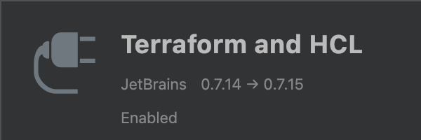

# Set up your favourite IDE

To be a great developer you need great tools. In this guide we will walk you through setting up your choice of integrated development environment (IDE). This guide provides the steps to setting up either <a href="https://code.visualstudio.com/" target="_blank">Visual Studio Code (VS Code)</a> or <a href="https://www.jetbrains.com/go/" target="_blank">JetBrains GoLand</a>.

>To complete this guide you will have to install **alis.exchange** CLI, the core tool to manage all resources on **alis.exchange**. Follow the steps in the [command line interface](./command-line-interface.md) guide to install the CLI.
## Which IDE to choose?

A few things to consider when choosing your IDE. VS Code and GoLand provides support for a wide range of languages including Go and therefore are the favourites amongst the **alis.exchange** community. VS Code being open source is completely free whereas GoLand has an annual license fee. Plugins have been built by the **alis.exchange** community for both IDEs, to create the best possible developer experience.

## Visual Studio Code 

1. Follow the relevant <a href="https://code.visualstudio.com/download" target="_blank">installation instructions</a> for your device.

2. In the IDE, under the extensions tab, search for and install the latest versions of the following plugins:

<div class="VSCodePluginContainer"> 

::: VSCodePluginImage

:::

::: VSCodePluginImage

:::

</div>

### Plugin Configuration

The aip linter plugin requires that there is either a `.api-linter.json` or `.api-linter.yaml` file in the project root. This file states which rules should be enabled or disabled. Read the installation notes on the <a href="https://marketplace.visualstudio.com/items?itemName=aoca.aip-linter" target="_blank">extension page</a>.

## Jetbrains GoLand


1. Follow the relevant <a href="https://www.jetbrains.com/go/download/" target="_blank">installation instructions</a> for your device.
> Start off using the trial version. Notify your organisation to purchase a license for your account if this was not yet provided.
2. In the IDE, open the _Preferences_ and navigate to _Plugins_. In the marketplace, search for and install the latest versions of the following plugins:

    <div class="GoLandPluginContainer"> 

    ::: GoLandPluginImage
    
    :::

    ::: GoLandPluginImage
    
    :::

    ::: GoLandPluginImage
    
    :::

    ::: GoLandPluginImage
    
    :::

    ::: GoLandPluginImage
    
    :::

    </div>
    

    

### Plugin Configuration

#### AIP Linter Plugin
The AIP linter plugin requires the installation of the executable file built by <a href="https://linter.aip.dev/" target="_blank">Google</a>. This can be done by running in the terminal (Mac: `⌥ + F12` or Windows: `ALT + F12`):
```shell
go install github.com/googleapis/api-linter/cmd/api-linter@latest
```
Once this is installed, you will need to point the plugin to this downloaded `api-linter.exe` file.
In _Preferences/Tools/AIP Linter_ set the `api_linter_executable` to the downloaded executable. This should be in the
_/Users/{{YourUsername}}/go/bin_ directory.

The `Import Paths` are used to find imported `*.proto` files. At this stage, we will simply add the Google protos.<br />

> ❗ Ensure that you have run the command `alis org get google` from your terminal to get the relevant protos downloaded locally.

Unselect the option to `Configure automatically` and add the path to the Google proto directory, _/Users/{YourUsername}/alis.exchange/google/proto_,
to the `Import Paths`.

Your final configuration should look similar to the image below. 


### Protocol Buffers Plugin

Similar to the AIP Linter Plugin, the Protocol Buffers Plugin requires a specification of the directories where imported
protos can be found. At this stage, we will simply add the Google protos. 

> Follow these steps to add your organisation's protos directory.

Select the *Configure Automatically* checkbox and *Apply*. 

While leaving the *JetBrains Protoeditor* directory path, add the path to the Google proto directory, _/Users/{YourUsername}/alis.exchange/google/proto_, to the `Import Paths`.

Your final configuration should look similar to the image below.


## Whats next?

Now that your IDE is setup and the **alis.exchange** CLI is installed, try your hand at [making your first request](./make-your-first-request.md) to a product or [building your own product](./make-your-first-request.md).
